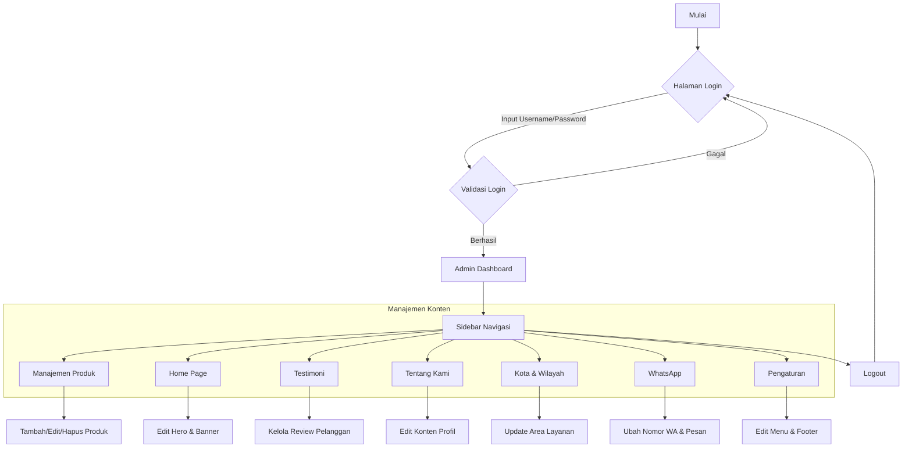

# Panel Admin Florist

Dokumentasi ini menjelaskan struktur navigasi dan alur kerja panel admin untuk aplikasi Florist.

## Alur Kerja Admin (Flowchart)

Berikut adalah diagram alur proses yang dilakukan oleh admin, mulai dari login hingga manajemen konten:

## Struktur Folder Admin

- `src/admin/pages/`: Halaman-halaman utama panel admin.
- `src/admin/components/`: Komponen UI khusus admin (seperti ProtectedRoute).
- `src/admin/hooks/`: Logika kustom untuk autentikasi dan pengambilan data admin.
- `src/admin/layout/`: Tata letak (Layout) utama yang menyediakan sidebar dan header.

## Cara Menggunakan
1. Buka rute `/admin/login` untuk masuk.
2. Gunakan sidebar untuk berpindah antar menu manajemen.
3. Semua perubahan data akan langsung tersimpan ke database (Supabase).
